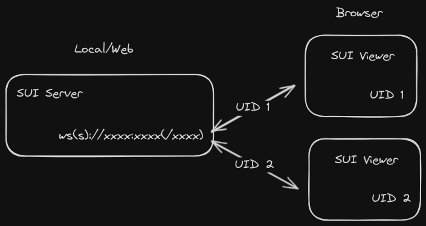

# SUI - An UI Framework for Struct Data

SUI 是一个用户界面框架，数据通信基于 WebSocket 协议，目标是为无显示应用环境（如命令行应用）提供简单的交互支持

## 对比

### 和 HTML 的区别

- HTML 是基于 HTTP 协议的，属于单向传递，而 SUI 则使用 WebSocket 协议，属于双向传递，所以来自服务器的变更可以很快速地发送到客户端
- HTML 的目标是表达富文本内容，而 SUI 的目标则是表达交互界面，所以在编码的方便程度上有很大区别
- 经过很长一段时间的演变，HTML 已经变得非常复杂和难以使用，而 SUI 则没有这方面的问题
- HTML 应用的计算负载主要位于客户端，这一策略降低了服务端的性能消耗和交换的数据量，但同时也导致服务端对于客户端的可控制性的降低，以及更长的数据交换周期，最终导致应用的可用性和响应速度变差；相比之下 SUI 则将客户端的职责严格限制在「交互」内，虽然会导致交换的数据量以及服务端的负载增大，但因为 SUI 的使用情况主要都是服务端和客户端在一台机器，所以没有影响
- 当通过网络端口提供 HTTP 服务来创建 HTML 网页界面时，需要 HTTP 和 WS 各一个端口和服务，而且也需要提供 HTML 渲染所使用的静态数据，开销很大，而相比之下使用 SUI 则只需要一个端口和服务，也不需要额外的静态数据

## 框架架构

